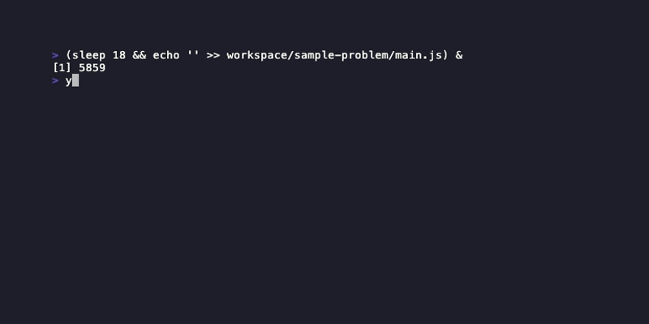

```
 _   _                 _               _ _   _
| | | | __ _ _ __   __| |_      ___ __(_) |_| |_ ___ _ __
| |_| |/ _` | '_ \ / _` \ \ /\ / / '__| | __| __/ _ \ '_ \
|  _  | (_| | | | | (_| |\ V  V /| |  | | |_| ||  __/ | | |
|_| |_|\__,_|_| |_|\__,_| \_/\_/ |_|  |_|\__|\__\___|_| |_|
```

**A hot-reload practice environment for coding interview problems.**

  

Select a problem, pick JavaScript or Python, and start coding — tests re-run automatically on every save. Problems reveal themselves progressively: you only see the next part after passing the current one. An AI agent can generate new problems, give hints mid-session, and review your solutions, but the CLI itself has no AI dependency. The irony is intentional: an AI-powered toolkit for practicing without AI.



---

## Quick Start

```bash
corepack enable
git clone <repo-url> && cd handwritten
yarn install
yarn start
```

On first run, select a problem, choose a language, and start coding. Tests re-run on every save.

---

## What's in the Box

:repeat: **Hot-reload test runner** — save your file and tests run automatically, results in the summary line within seconds. [Details →](docs/getting-started.md#5-start-coding)

:jigsaw: **Progressive multi-part problems** — parts unlock as you pass tests, building on your solution in a single file. [Details →](docs/getting-started.md#progressive-revelation)

:stopwatch: **Built-in timer** — stopwatch or countdown mode with color-coded urgency, pause support, and per-part split times. [Details →](docs/stats-and-timer.md)

:bar_chart: **Stats and attempt history** — total practice time, solve times, streaks, and per-problem attempt history with splits. [Details →](docs/stats-and-timer.md#stats-computation)

:gear: **Settings editor** — configure topics, difficulty, style, and generation behavior from the CLI or an agent skill. [Details →](docs/settings.md)

:robot: **Agent skills** — generate problems, get tiered hints mid-session, and receive structured solution reviews. [Details →](docs/agent-skills.md)

:lock: **VS Code with AI completions disabled** — sandboxed editor session with Copilot, Tabnine, and Codeium turned off. [Details →](docs/getting-started.md#vs-code-sandboxing)

:clipboard: **Problem list browser** — browse all available problems with descriptions and your current status without starting a session. [Details →](docs/getting-started.md#8-review-your-stats)

---

## Docs

| Doc | What's in it |
|---|---|
| [Getting Started](docs/getting-started.md) | Prerequisites, install, first run walkthrough, VS Code setup, troubleshooting |
| [Agent Skills](docs/agent-skills.md) | Generate problems, hints, solution review — full skills reference |
| [Settings](docs/settings.md) | All config options, Surprise Me mode, detail hiding |
| [Problem Schema](docs/problem-schema.md) | Adding problems, JSON schema reference, test conventions |
| [Timer & Stats](docs/stats-and-timer.md) | Session persistence, timer modes, stats computation |

The CLI has no AI dependency. Agent skills are optional and interact through the filesystem only.

---

## Project Structure

```
.claude/skills/              # Native Claude Code skill files (slash commands)
.agents/                     # Agent skills system (no runtime dependency)
  scripts/                   #   Randomization and utility scripts (with tests in tests/scripts/)
  templates/                 #   Schema and config templates
  context/                   #   Domain knowledge documents
problems/                    # Read-only problem definitions (never modified at runtime)
  <name>/                    #   problem.json, stubs (main.js/py), test suites
workspace/                   # Gitignored working area — solutions, sessions
runner/                      # CLI source (Node.js ESM, React/Ink)
  components/                #   Screen components (one per menu/view)
tests/                       # Unit tests (yarn test)
  runner/                    #   CLI logic tests
  scripts/                   #   Agent script tests
media/                       # Screenshots, GIFs, VHS tapes, and fixtures
  tapes/                     #   VHS tape definitions
  fixtures/                  #   CLI state fixtures used during recording
  output/                    #   Generated screenshots and GIFs (committed)
scripts/                     # Repository utility scripts
docs/                        # Reference documentation
config.json                  # User-specific settings (gitignored) — copy from config.example.json
```
